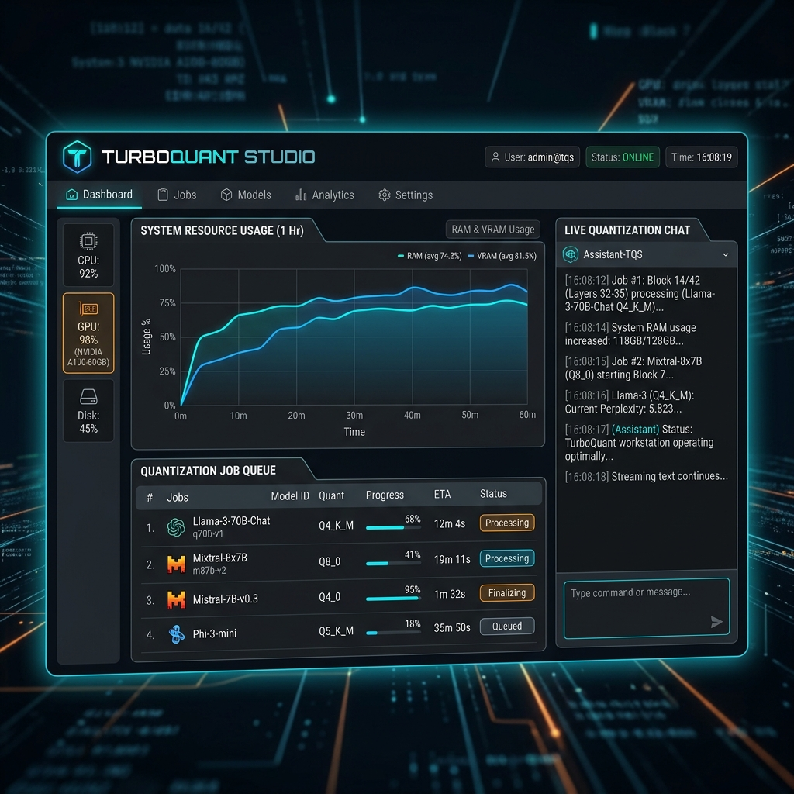

# 🚀 TurboQuant Studio <span style="font-size: 0.4em; opacity: 0.5;">v1.1.0</span>

**TurboQuant Studio** is a professional-grade, local quantization workstation built with Tauri, React, and `llama.cpp`. It provides an end-to-end pipeline to convert, quantize, and test LLMs directly on your desktop with a premium, real-time interface.



## 🌟 Key Features

- **Memory-Efficient GGUF Conversion**: Seamlessly convert HuggingFace models to GGUF using disk-swapping (`--use-temp-file`) to prevent OOM errors on limited hardware.
- **Advanced Quantization**: Support for all major `llama.cpp` quantization levels (Q4_K_M, Q8_0, etc.) with a visual job queue.
- **Real-time Streaming Playground**: A built-in chat interface with SSE (Server-Sent Events) streaming for instant feedback during model testing.
- **Local Analytics**: Monitor your quantization jobs and manage your model library locally.
- **GPU Accelerated**: Built to leverage available GPU layers for lightning-fast inference.

## 🛠️ Technology Stack

- **Frontend**: React 19, Vite, Tailwind CSS, shadcn/ui
- **Desktop Shell**: Tauri (Rust)
- **Backend**: Python FastAPI Sidecar
- **Engine**: `llama.cpp` (C++)
- **Database**: SQLModel / SQLite

## 🚀 Getting Started

### Prerequisites
- **Node.js** (v18+)
- **Python** (v3.10+)
- **CMake** (for building the quantization engine)
- **Rust** (for Tauri)

### Installation
1. Clone the repository:
   ```bash
   git clone https://github.com/agent9ether/turbo-quant-studio.git
   cd turbo-quant-studio
   ```
2. Install dependencies:
   ```bash
   npm install
   ```
3. Run the development environment:
   ```bash
   npm run tauri dev
   ```

## 📖 How to Use

1.  **Initialize**: Paste a local model path in the **Import** tab to start.
2.  **Quantize**: Use the **Workbench** to select your bit-depth (e.g., `Q4_K_M`).
3.  **Monitor**: Watch real-time **Analytics** gauges as your hardware processes the model.
4.  **Test**: Launch the **Playground** to chat with your newly optimized model.

For more detailed instructions, see the [User Guide (USAGE.md)](./USAGE.md).

## 🤝 Contributing

We welcome and encourage contributions from the community! Whether you're fixing bugs, adding new quantization engines, or improving the Cyber-Technical UI, your help makes **TurboQuant Studio** better for everyone.

1.  Fork the Project.
2.  Create your Feature Branch (`git checkout -b feature/AmazingFeature`).
3.  Commit your Changes (`git commit -m 'Add some AmazingFeature'`).
4.  Push to the Branch (`git push origin feature/AmazingFeature`).
5.  Open a Pull Request.

## 🔓 Open Source & Attribution

This project is built on the shoulders of giants. We encourage others to use, modify, and build upon this codebase. We only ask that you **give credit where it's due** by attributing the original work to **Hustla** and the **Ethernine Protocol**.

## 📝 License
Distributed under the MIT License. See `LICENSE` for more information.

---
Built with ❤️ by **Hustla** | Powered by **Ethernine Protocol**
